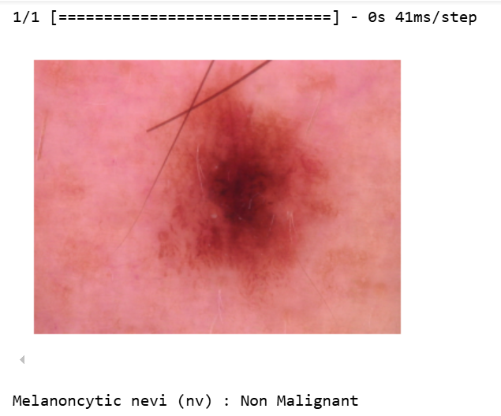

# 🧬 Skin Cancer Prediction using CNN

This project uses a **Convolutional Neural Network (CNN)** model to classify and predict different types of skin cancer using the **HAM10000** dataset. The goal is to assist in early and accurate detection of dermatological diseases using deep learning.



---

## 📦 Dataset Source – HAM10000

The dataset used for this project is the **"Human Against Machine with 10000 training images" (HAM10000)**, a large collection of multi-source dermatoscopic images of common pigmented skin lesions.

You can download the dataset from either of the following sources:

### ✅ Kaggle
**Link**: [https://www.kaggle.com/datasets/kmader/skin-cancer-mnist-ham10000](https://www.kaggle.com/datasets/kmader/skin-cancer-mnist-ham10000)

- Requires a Kaggle account.
- Use `kaggle` CLI or download manually.
- Dataset includes:
  - `HAM10000_images_part_1/`
  - `HAM10000_images_part_2/`
  - `HAM10000_metadata.csv`

### ✅ Harvard Dataverse (official page)
**Link**: [https://dataverse.harvard.edu/dataset.xhtml?persistentId=doi:10.7910/DVN/DBW86T](https://dataverse.harvard.edu/dataset.xhtml?persistentId=doi:10.7910/DVN/DBW86T)

- Contains a zip file of all images and metadata.
- Download the entire dataset to your local machine for preprocessing.

> **Note:** Due to the large size, it is recommended to work with a GPU-supported runtime (e.g., Google Colab or Kaggle Notebooks).

---

## 🧠 Model Architecture (CNN)

A deep Convolutional Neural Network is used with the following highlights:

- Input shape: **28x28x3** (Images resized)
- 4 Convolution blocks with Batch Normalization and MaxPooling
- Fully Connected layers with Dropout for regularization
- Final output layer with **7 softmax units** (for 7 skin cancer types)

### 🔍 Code Highlights:
```
model = keras.models.Sequential()

model.add(keras.layers.Input(shape=[28, 28, 3]))
model.add(Conv2D(32, (3, 3), activation='relu', padding='same'))
model.add(MaxPooling2D())
model.add(BatchNormalization())

model.add(Conv2D(64, (3, 3), activation='relu', padding='same'))
...
model.add(Dense(7, activation='softmax'))

model.compile(
    optimizer=Adamax(learning_rate=0.001),
    loss='categorical_crossentropy',
    metrics=['accuracy']
)
````

Model is trained using:

```
model.fit(X_train, y_train,
          epochs=5,
          batch_size=128,
          validation_data=(X_test, y_test),
          callbacks=[learning_rate_reduction])
```

---

## 📊 Evaluation Metrics

* **Confusion Matrix**
* **Classification Report**
* **Accuracy Score**
* **Validation Loss Graphs**

---

## 🔧 Libraries Used

* `TensorFlow`, `Keras` – Deep Learning
* `NumPy`, `Pandas` – Data manipulation
* `Matplotlib`, `Seaborn` – Visualization
* `Sklearn` – Preprocessing, Evaluation
* `ImageDataGenerator` – Augmentation

---

## ⚠️ Important Advice

> **Please do not use any pre-processed or unofficial dataset sources.**
> Always download the original dataset from the official **Harvard Dataverse** or **Kaggle** page to ensure integrity and scientific accuracy.

---

## 📌 Skin Cancer Classes

| Label | Disease                             |
| ----- | ----------------------------------- |
| 0     | Actinic keratoses (akiec)           |
| 1     | Basal cell carcinoma (bcc)          |
| 2     | Benign keratosis-like lesions (bkl) |
| 3     | Dermatofibroma (df)                 |
| 4     | Melanoma (mel)                      |
| 5     | Melanocytic nevi (nv)               |
| 6     | Vascular lesions (vasc)             |

---

## 📈 Future Improvements

* Increase number of training epochs for better accuracy.
* Implement early stopping and model checkpointing.
* Explore transfer learning using **EfficientNet** or **ResNet50**.

---

## 🧠 Author

Built with ❤️ by **Swarupa Balaji**

> *"Early detection saves lives — Deep Learning makes it faster."*

---

```
```
